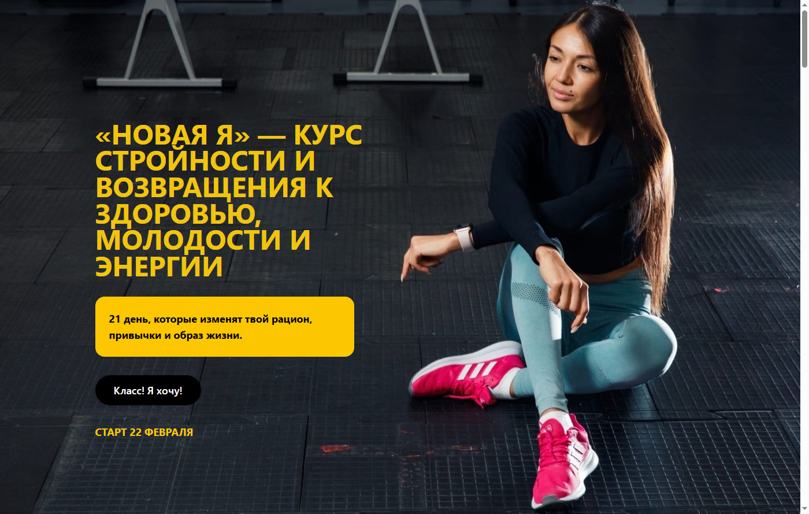
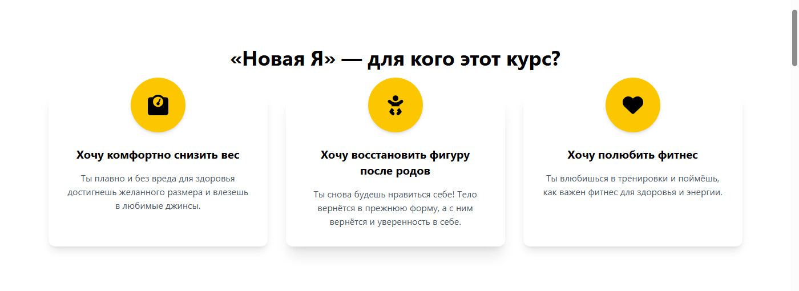
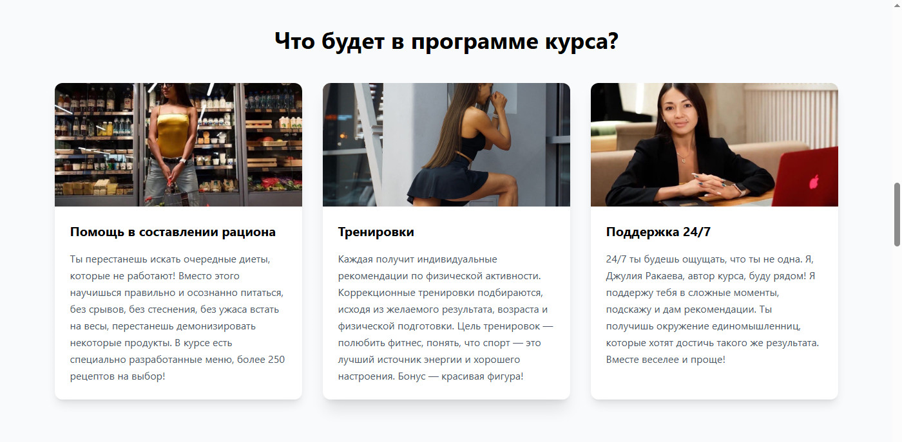
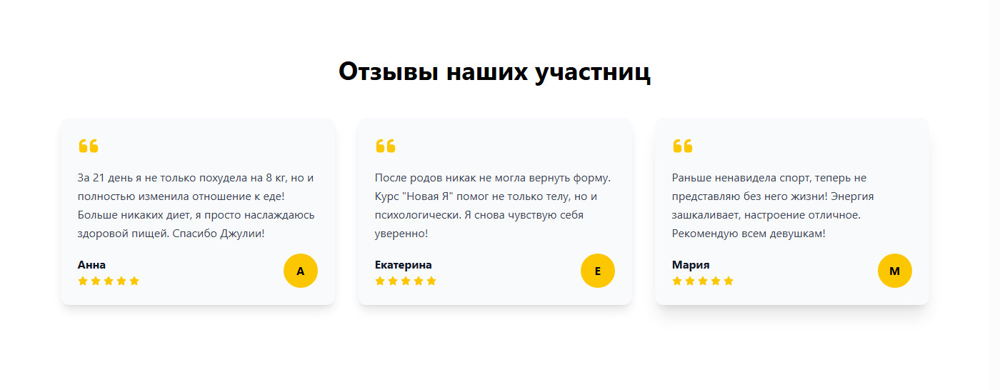
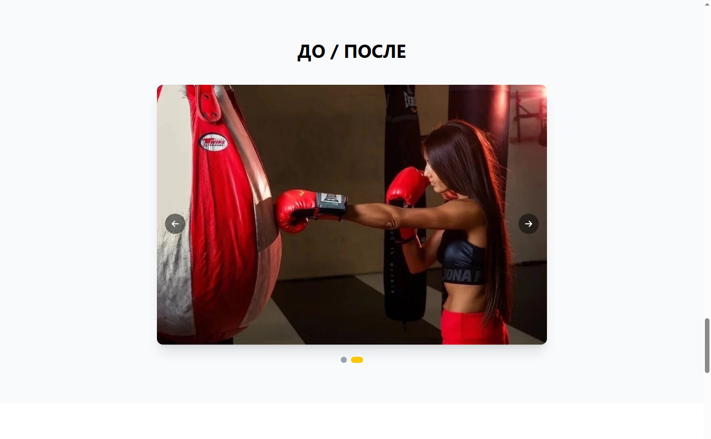
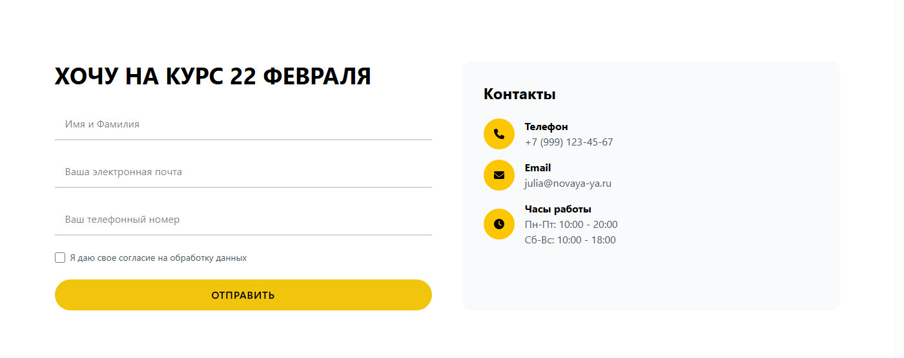
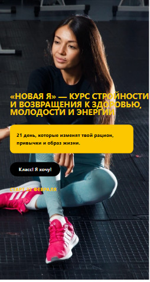
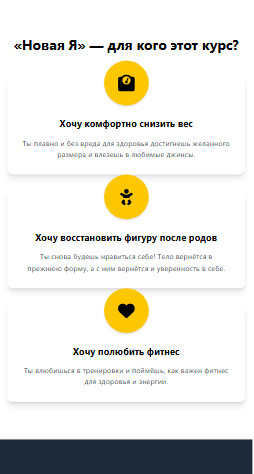

# 💪 Новая Я - Курс стройности


## 📸 Скриншоты

### Десктоп версия

| Главная страница | Для кого этот курс |
|-----------------|-------------------|
|  |  |

| Программа курса | Отзывы |
|-----------------|--------|
|  |  |

| До/После | Форма записи |
|----------|-------------|
|  |  |

### Мобильная версия

| Главная (мобильная) | Программа (мобильная) |
|---------------------|----------------------|
|  |  |

## 🚀 Демо

[Посмотреть демо](https://semeeensemeeenov23.github.io/im-new/)

## 📱 Функционал

- ✅ Главная страница с Hero-секцией (фон, заголовок, кнопка)
- ✅ Блок "Для кого этот курс" (3 карточки с иконками)
- ✅ Блок с фотографиями и цитатой
- ✅ Программа курса (3 карточки с изображениями)
- ✅ Блок преимуществ (3 колонки с иконками и текстом)
- ✅ Об авторе (фото, описание, кнопка)
- ✅ Статистика результатов (70%+ возвращаются, 30-40% переходят на новый поток)
- ✅ Галерея "До/После" (слайдер)
- ✅ Отзывы участниц (3 отзыва с рейтингом)
- ✅ Форма записи на курс
- ✅ Плавающие GIF-анимации (появляются при бездействии 15 сек, меняются каждые 5 сек)
- ✅ Адаптивный дизайн (мобильные, планшеты, десктоп)
- ✅ Плавные анимации (Framer Motion)
- ✅ Автоматическое обновление года в футере

## 🛠 Технологии

- **React 19** + **TypeScript**
- **Vite** - сборка
- **Tailwind CSS** - стилизация
- **Framer Motion** - анимации
- **React Icons** - иконки
- **React Router** - навигация

## 📦 Установка и запуск

```bash
# Клонировать репозиторий
git clone https://github.com/semeeensemeeenov23/im-new.git

# Перейти в папку проекта
cd im-new

# Установить зависимости
npm install

# Запустить в режиме разработки
npm run dev

# Собрать для продакшена
npm run build

# Предпросмотр сборки
npm run preview